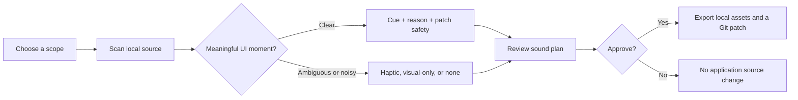

<p align="center">
  
</p>

<h1 align="center">Wubble UI Sounds</h1>

<p align="center">
  Semantic, local-first UI sound for web and React Native apps.
</p>

<p align="center">
  <a href="LICENSE"></a>
  
  
  
</p>

Wubble scans **apps and websites** for meaningful interaction moments, recommends
the right feedback, and lets developers approve a normal Git patch. The selected
audio is shipped as local files owned and served by the application. No runtime
service, no API key, and no source code leaves the developer's machine.

## Add Sound in Seconds

```bash
npm install @wubble/ui-sounds
npx wubble-ui-sounds add . --scope src/app,src/features --cache --setup
```

Wubble does the discovery work: it scans local source, groups recommendations by
app flow, explains each recommendation, and creates a normal Git patch for
review. It never edits application source until the developer explicitly
approves a reviewed change.

**The difference:** Wubble reads the app or website and proposes a sound plan;
developers do not have to map every button, state, and outcome to an audio file
by hand.

## The Full Sound Library

The 16-cue Core pack is the **small export Wubble places in an app**, not the
size of the library. The full CC0 catalog is available through
[`@wubble/community-sfx`](packages/community-sfx/README.md).

| Library | What it contains | What an app ships |
| --- | --- | --- |
| **Wubble Core** | 16 canonical app events in MP3, WebM Opus, and AAC/M4A | A compact, 120 KiB local pack |
| **Wubble Community SFX** | **936 sound designs**: 78 semantic cues across 12 personalities, in both MP3 and Ogg | Only the chosen 16-cue personality export, up to 240 KB |

The full catalog has not gone anywhere: it contains **1,872 portable audio
files** because each of the 936 designs has MP3 and Ogg versions. Core keeps the
default integration fast; the optional catalog gives teams a broad sonic palette
without forcing every website or app to ship it all.

## Why Wubble

| Wubble handles | Developers retain |
| --- | --- |
| Finds likely feedback moments in local code | Final say on every sound and code change |
| Recommends a cue, haptic, visual-only feedback, or no sound | Existing design and accessibility decisions |
| Groups suggestions by app flow and writes a reviewable patch | Their normal Git review and deployment process |
| Exports only selected local files | Full ownership of runtime delivery |

## Choose a Starting Point

| You need | Start here |
| --- | --- |
| A compact, consistent baseline | `@wubble/ui-sounds` and the included 16-cue Core pack |
| The complete library | [`@wubble/community-sfx`](packages/community-sfx/README.md): 936 sound designs across 12 personalities |
| A working reference | [vanilla](examples/vanilla/), [Next.js](examples/nextjs/), or [React Native](examples/react-native/) examples |
| Existing app recommendations | [`wubble-ui-sounds add`](#developer-workflow) or [`wubble-ui-sounds audit`](#developer-workflow) |

The source code and documentation are licensed under [Apache-2.0](LICENSE).
Audio assets have separate terms; see [Audio Licensing](AUDIO-LICENSES.md).

## Developer Workflow

Wubble makes a recommendation; the developer makes the decision. The scan is a
deterministic local structural analysis of JS, TS, JSX, and TSX. It does not use
a hosted model, require an AI account, or upload application source.



| What Wubble sees | What it recommends | What happens automatically |
| --- | --- | --- |
| Explicit client-side async success or failure | Semantic success, error, processing, or complete cue | A hash-bound, reviewable safe-patch candidate |
| Sends, deletes, toggles, navigation, and toasts | A semantic cue or an explicit non-sound choice | Manual review by default |
| Dense repeated controls or already-visible feedback | Haptic, visual-only, or no sound | No patch |
| Existing Wubble integration | Nothing | It is skipped to avoid duplicate instrumentation |

### Run the guided scan

```bash
npx wubble-ui-sounds add . --scope src/app,src/features --cache --setup
```

| Wubble writes locally | Why it matters |
| --- | --- |
| `sound-plan.md` | Recommendations grouped by app flow, with source context and rationale |
| `recommended.patch` | A normal Git patch for safe, approved source changes |
| `approved-plan.json` | The explicit decisions the developer made |
| `patch-preview.json` | A hash-bound preview that protects changed files from accidental application |

For a large codebase, narrow the scan with `--scope` and reuse unchanged results
with `--cache`. Wubble ignores dependencies and generated output, skips files
over 1 MiB, and stops at 4,000 source files rather than pretending an unlimited
scan is reliable.

<details>
<summary><strong>Advanced CLI reference: explicit audits, previews, managed packs, and rollback</strong></summary>

### Guided Add

For the shortest path, let the guided local workflow inspect the app and export
the included local Core pack only when it is needed:

```bash
npx wubble-ui-sounds add /absolute/path/to/customer-app \
  --scope src/app,src/features --cache --setup
```

`add` scans source files only on the developer's machine. It does not call an AI
model or upload source code. It groups detected moments by product flow, shows
the source location, a short local code context, and why it made the
recommendation. It labels sound moments as a safe-patch candidate or a
manual-review item before the developer approves them. In an interactive
terminal, approve an entire flow or review the moments individually. It also
records deliberate non-sound guidance:
`haptic` for likely dense setting controls, `visual-only` for already-visible
toast outcomes, and `none` for navigation that should not be made noisy by
default.

By default, the command is review-first. It writes these local artifacts under
`.wubble-ui-sounds/` without editing application source:

- `latest-audit.json`: the read-only detection record.
- `sound-plan.md`: grouped recommendations, rationale, source context, and
  non-sound guidance.
- `approved-plan.json` and `patch-preview.json`: the explicitly selected plan
  and hash-bound safe edits.
- `recommended.patch`: a standard patch suitable for normal code review.

Review the patch in an editor or with Git before deciding how to land it:

```bash
git apply --check .wubble-ui-sounds/recommended.patch
git apply .wubble-ui-sounds/recommended.patch
```

Use `--patch review/wubble-ui-sounds.patch` to write it elsewhere. The
alternative `--apply` path still requires an explicit terminal confirmation,
checks the preview and source-file hashes, and writes a rollback record before
changing code. In CI, use `--select all|none|<candidate-ids>`; add `--yes` only
when an intentional non-interactive apply is required. `--force` replaces an
earlier local review artifact, never a customer source file.

For large repositories, use `--scope` with one or more project-relative folders
or source files, and `--cache` to reuse hash-matched local analysis results.
The audit skips dependencies, generated output, files over 1 MiB, and stops at
4,000 source files. It tells the developer when that ceiling is reached.

### Sound Audit

Use the read-only audit before adding feedback to an existing product. It uses a
local JavaScript/TypeScript/JSX parser, identifies semantic moments worth
reviewing, and never changes application files or sends source code anywhere:

```bash
npx wubble-ui-sounds audit /absolute/path/to/customer-app
```

The audit recommends high-confidence async outcomes, send actions, destructive
completion, toggles, navigation, and visible toast outcomes. It deliberately
skips generic controls rather than making the product noisy. Use `--format json`
to review or integrate the exact plan in other local developer tooling.
It ignores dependencies and generated output, scans up to 4,000 source files, and
skips individual files over 1 MiB. Files that already import Wubble feedback are
reported as skipped to avoid duplicate instrumentation.

Review and record only the moments that fit the product. Saving an approval plan
does not change customer source files:

```bash
npx wubble-ui-sounds audit /absolute/path/to/customer-app --format json > /tmp/wubble-audit.json
npx wubble-ui-sounds approve \
  --plan /tmp/wubble-audit.json \
  --select F012-processing-success-error,F034-send
```

Use `--select all` to approve every recommendation or `--select none` to record
that none are appropriate. By default the approval record is written to
`.wubble-ui-sounds/approved-plan.json` in the audited project. The apply command
accepts only this reviewed record.

Create a hash-bound patch preview from the approved recommendations. This is
still read-only: it saves a preview record, not a source-code change. In this
first release it proposes an exact wrapper only for explicit client-side async
outcome handlers. Navigation, toggles, toasts, destructive actions, and anything
ambiguous remain manual-review items instead of being guessed at.

```bash
npx wubble-ui-sounds preview-apply \
  --approval /absolute/path/to/customer-app/.wubble-ui-sounds/approved-plan.json
```

The preview records the source-file hashes and exact proposed replacements under
`.wubble-ui-sounds/patch-preview.json`. Run `wubble-ui-sounds setup` before an
apply step so `src/lib/wubble-ui-sounds.js` is present. This command never
changes source files.

After reviewing the printed diff, use the exact confirmation hash printed by the
preview command. `apply` verifies that hash, the original source-file hashes, and
every proposed source range before it writes. It creates the rollback snapshot
and application record before changing code; `--dry-run` performs all checks
without writing.

```bash
npx wubble-ui-sounds apply \
  --preview /absolute/path/to/customer-app/.wubble-ui-sounds/patch-preview.json \
  --confirm <reviewed-preview-sha256>

npx wubble-ui-sounds rollback-changes \
  --record /absolute/path/to/customer-app/.wubble-ui-sounds/applied-patch.json
```

`apply` never accepts a force flag and stops when either the preview or source has
changed. `rollback-changes` likewise stops if the applied source has since been
edited, protecting later developer work.

### Scanner Accuracy

Run the maintained labeled regression corpus with:

```bash
npm run audit:evaluate
```

It currently covers 19 expected semantic detections plus conservative negative
fixtures, and reports precision and recall for that controlled corpus. It is a
guard against scanner regressions, not a claim that the heuristic will be
equally accurate in arbitrary production repositories. Real-project accuracy is
measured separately through reviewed developer trials.

```bash
# Validate files, hashes, duration metadata, and the 120 KB default budget.
npm run ui-sounds -- validate examples/vanilla/public/wubble/signal/manifest.json

# See the selected events and exact byte usage.
npm run ui-sounds -- inspect examples/vanilla/public/wubble/signal/manifest.json

# Export the local fixture into a customer app directory.
npm run ui-sounds -- export \
  --source examples/vanilla/public/wubble/signal \
  --target /absolute/path/to/customer-app \
  --dry-run

# Preview an approved newer revision, then remove --dry-run to apply it.
npm run ui-sounds -- upgrade \
  --source /absolute/path/to/signal-r2 \
  --target /absolute/path/to/customer-app \
  --dry-run

# Restore a local snapshot created before the upgrade.
npm run ui-sounds -- rollback \
  --target /absolute/path/to/customer-app \
  --pack signal \
  --revision 1

# Export only the selected bundled mobile assets and a Metro-safe require() map.
npm run ui-sounds -- export \
  --source /absolute/path/to/approved-pack \
  --target /absolute/path/to/react-native-app \
  --platform react-native \
  --dry-run

# Verify and install an approved signed release artifact.
npm run ui-sounds -- verify-archive \
  --archive /absolute/path/to/approved-pack.wubblepack \
  --trusted-keys /absolute/path/to/wubble-trusted-keys.json

npm run ui-sounds -- install \
  --archive /absolute/path/to/approved-pack.wubblepack \
  --trusted-keys /absolute/path/to/wubble-trusted-keys.json \
  --target /absolute/path/to/customer-app

# Apply a signed newer revision through the same managed upgrade protection.
npm run ui-sounds -- upgrade \
  --archive /absolute/path/to/approved-pack-r2.wubblepack \
  --trusted-keys /absolute/path/to/wubble-trusted-keys.json \
  --target /absolute/path/to/customer-app
```

Remove `--dry-run` to write the files. Web export writes `public/wubble/<pack>/`, `src/lib/wubble-ui-sounds.js`, and `wubble.ui-sounds.yml`. React Native export writes `src/assets/wubble/<pack>/`, `src/lib/wubble-ui-sounds.native.js`, and `wubble.ui-sounds.native.yml`; it selects AAC/M4A where the approved pack provides it and emits static Metro `require()` calls. Each platform has separate hashes and snapshots under `.wubble-ui-sounds/<pack>/`. `install` first validates the Ed25519 signature, trusted signing key, archive schema, manifest compatibility, pack metadata, release records, and every asset hash before using that same protected export path. Export refuses to overwrite changed files unless `--force` is supplied. Upgrade and rollback never overwrite changed managed files.

### Release key registry

Use a checked-in or securely distributed JSON registry for routine releases. Its key id must match the archive signature. `active` keys sign and verify new releases, `retired` keys continue to verify older approved releases, and `revoked` keys are rejected immediately. A direct `--public-key` PEM remains supported for a one-off controlled installation.

```json
{
  "schemaVersion": 1,
  "keys": {
    "release-2026-08": {
      "status": "active",
      "publicKey": "-----BEGIN PUBLIC KEY-----\\n...\\n-----END PUBLIC KEY-----\\n"
    }
  }
}
```

See [manifest compatibility](docs/MANIFEST_COMPATIBILITY.md) before changing the customer manifest contract.

</details>

## Feedback Policy

Each event can carry an optional policy alongside its local asset. The runtime uses it to make feedback deliberate rather than noisy: it can rate-limit repeated cues, suppress low-priority cues in reduced or quiet contexts, and allow important state feedback to interrupt a less important active cue.

```json
{
  "policy": {
    "cooldownMs": 120,
    "priority": "low",
    "intensity": "subtle",
    "hapticIntent": "selection"
  }
}
```

Production packs can also declare up to five local variants per event. The runtime rotates them by default, avoiding repetitive feedback without a runtime service request. `setReducedFeedback(true)` and `setQuietMode(true)` let an application suppress low-priority feedback when appropriate.

### Local codec sources

Production manifests can keep an MP3 primary and add ordered local codec sources. The browser runtime uses the first supported alternate and otherwise retains the primary asset; React Native export selects its AAC/M4A alternate where present. No service URL, negotiation request, or runtime credential is involved.

```json
{
  "file": "assets/tap.4c32f7a1.mp3",
  "durationMs": 90,
  "sha256": "4c32f7a1",
  "sources": [
    {
      "file": "assets/tap.a887ff2c.webm",
      "mimeType": "audio/webm; codecs=opus",
      "durationMs": 90,
      "sha256": "a887ff2c"
    },
    {
      "file": "assets/tap.6642cf11.m4a",
      "mimeType": "audio/mp4; codecs=mp4a.40.2",
      "durationMs": 90,
      "sha256": "6642cf11"
    }
  ]
}
```

The private compiler creates and budgets every declared local file. Verify the source-selection path on each supported device before release; the [browser matrix](docs/BROWSER_MATRIX.md) records that evidence.

## React and Next.js

`@wubble/react` keeps audio inside a Client Component while the rest of a Next App Router page can remain server-rendered.

```jsx
"use client";

import { FeedbackProvider, FeedbackSettings, useFeedback } from "@wubble/react";
import { feedbackManifest } from "@/lib/wubble-ui-sounds";

export function ProductFeedback() {
  return (
    <FeedbackProvider manifest={feedbackManifest} baseUrl="/wubble/signal">
      <FeedbackSettings />
      <SaveButton />
    </FeedbackProvider>
  );
}

function SaveButton() {
  const { play } = useFeedback();
  return <button onClick={() => void play("success")}>Save</button>;
}
```

See [the App Router example](examples/nextjs/README.md) for the complete local setup. Exported audio filenames include a content hash, so configure immutable caching for those files and use short revalidation for `manifest.json`.

### Contextual flows

Use `useAsyncFeedback` for actions that visibly enter a pending state, then complete or fail. It preserves the existing UI behavior and adds semantic local feedback around it.

```jsx
import { useAsyncFeedback } from "@wubble/react";

function SaveDraftButton() {
  const save = useAsyncFeedback();

  async function handleSave() {
    await save.run(() => saveDraft());
  }

  return (
    <button type="button" disabled={save.status === "pending"} onClick={() => void handleSave()}>
      {save.status === "pending" ? "Saving" : "Save draft"}
    </button>
  );
}
```

`useAsyncFeedback` plays `processing` before the action, then `success` or `error`. Override those semantic events when a flow needs `send`, `complete`, or another declared event. Use `play("navigate")`, `play("notify")`, `play("receive")`, `play("warning")`, and `play("deleteConfirm")` directly at the corresponding product moment. Always retain visible pending, error, and confirmation states; audio is an optional supplement.

The [Next.js example](examples/nextjs/) includes a local release workspace that exercises button, navigation, form, toast, inbox, loading, error, and destructive-confirmation moments together.

### React Native flows

The mobile runtime uses the same manifest and policy contract. Supply a static Metro asset map and a native bridge. For Expo, the optional bridge uses `expo-audio` and `expo-haptics`; it is not a runtime service dependency.

```jsx
import { createNativeFeedbackClient } from "@wubble/react-native";
import { createExpoFeedbackBridge } from "@wubble/react-native/expo";

const bridge = await createExpoFeedbackBridge();
const feedback = createNativeFeedbackClient(manifest, {
  assets: (file) => assets[file],
  audio: bridge,
  haptics: bridge,
  enabled: false
});

feedback.setEnabled(true);
await feedback.success();
```

The [React Native example](examples/react-native/) shows the lifecycle-safe component form. Keep visual success, error, and pending states independent of feedback audio.

## Accessibility

Feedback audio is optional. Never disable a command, hide a result, or withhold error recovery because `play()` does not produce audio. `FeedbackSettings` supplies keyboard-accessible sound, volume, reduced-feedback, and quiet-context controls; the React provider persists the user preferences locally. React Native also exposes `setHapticsEnabled(false)` so applications can honor a separate haptics preference.

See [the accessibility contract](docs/ACCESSIBILITY.md) for the required application behavior and the runtime's non-playing results.

## Current status

The local runtime, signed local archive verification/install/upgrade, web and React Native CLI exports, React bindings, examples, trusted-key registry, and ordered local codec sources are working. `@wubble/core-pack` is a compiled 16-cue release candidate with local MP3, WebM Opus, and AAC/M4A delivery assets. Before public publication, retain the source-license record privately, complete the remaining browser/device and accessibility matrix, configure registry publishing and release-key custody, and complete the operational release checks.

## Release Rehearsal

Before a public release, prepare the same version in every public workspace and commit that change with its changelog entry:

```bash
npm run release:version -- 0.1.0
npm run release:version -- 0.1.0 --check
npm run release:smoke
```

The smoke command packs all six public packages, installs those exact artifacts into clean vanilla and Next.js projects, validates the installed Wubble Core pack, and builds the Next.js project. It never publishes. The GitHub release workflow performs the same verification first; its publish job requires the protected `npm-production` environment and complete release metadata.
